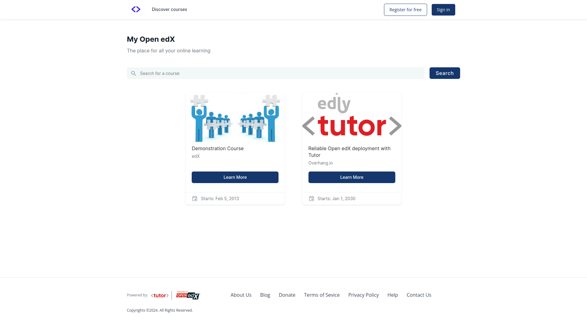

hdrukfuturestheme, a cool blue theme for Open edX
======================================

hdrukfuturestheme is an elegant, customizable theme for `Open edX <https://openedx.org>`__.

You can view the theme in action at https://sandbox.openedx.edly.io.

Installation
------------

hdrukfuturestheme was specially developed to be used with `Tutor <https://docs.tutor.edly.io>`__ (at least v14.0.0). If you have not installed Open edX with Tutor, then installation instructions will vary.

Install and enable hdrukfuturestheme plugin::

    tutor plugins install hdrukfuturestheme
    tutor plugins enable hdrukfuturestheme
    tutor local launch

The hdrukfuturestheme theme will be automatically enabled if you have not previously defined a theme. To override an existing theme, use the `settheme command <https://docs.tutor.edly.io/local.html#setting-a-new-theme>`__::

    tutor local do settheme hdrukfuturestheme

Configuration
-------------

- ``HDRUKFUTURESTHEME_WELCOME_MESSAGE`` (default: "The place for all your online learning")
- ``HDRUKFUTURESTHEME_PRIMARY_COLOR`` (default: "#3b85ff")
- ``HDRUKFUTURESTHEME_FOOTER_NAV_LINKS`` (default: ``[{"title": "About", "url": "/about"}, {"title": "Contact", "url": "/contact"}]``)
- ``HDRUKFUTURESTHEME_ENABLE_DARK_TOGGLE`` (default: True)

The ``HDRUKFUTURESTHEME_*`` settings listed above may be modified by running ``tutor config save --set HDRUKFUTURESTHEME_...=...``. For instance, to remove all links from the footer, run::

    tutor config save --set "HDRUKFUTURESTHEME_FOOTER_NAV_LINKS=[]"

Or, to set the primary color to forest green, run::

    # Note: The nested quotes are needed in order to handle the hash (#) correctly.
    tutor config save --set 'HDRUKFUTURESTHEME_PRIMARY_COLOR="#225522"'

Theme Toggle Button
-------------------

The theme toggle button is enabled by default when Tutor hdrukfuturestheme is installed. The theme can be switched from light to dark and vice versa. To disable it, run::

    tutor config save --set HDRUKFUTURESTHEME_ENABLE_DARK_TOGGLE=false
    tutor images build openedx
    tutor local start -d

Customization
-------------

This plugin can serve as a starting point to create your own themes. Just fork this repository and modify the files as you see fit.

You will have to start by installing hdrukfuturestheme from source::

    git clone https://github.com/overhangio/tutor-hdrukfuturestheme.git
    pip install -e ./tutor-hdrukfuturestheme
    tutor plugins enable hdrukfuturestheme

Any change you make to the theme can be viewed immediately in development mode (with `tutor dev ...` commands) after you run::

    tutor config save

To deploy your changes to production, you will have to rebuild the "openedx" Docker image and restart your containers::

    tutor images build openedx
    tutor local start -d

Changing the Styling in Sass files
~~~~~~~~~~~~~~~~~~~~~~~~~~~~~~~~~~

To customize the theme stylesheets, modify the files in the ``tutorhdrukfuturestheme/templates/hdrukfuturestheme/lms/static/sass/`` directory. In particular, the ``_extras.scss`` file should contain most styling rules. There is no CMS stylesheet: on Teak, Studio is the authoring MFE and is branded through ``MFE_CONFIG``.

Changing the default logo and other images
~~~~~~~~~~~~~~~~~~~~~~~~~~~~~~~~~~~~~~~~~~

The theme images are stored in ``tutorhdrukfuturestheme/templates/hdrukfuturestheme/lms/static/images``. The LMS serves them to the MFEs (including Studio) through ``/theming/asset/images/...``, so replacing the files in that folder rebrands everything.

Overriding the default "about", "contact", etc. static pages
~~~~~~~~~~~~~~~~~~~~~~~~~~~~~~~~~~~~~~~~~~~~~~~~~~~~~~~~~~~~

By default, the ``/about`` and ``/contact`` pages contain a simple line of text: "This page left intentionally blank. Feel free to add your own content". This is of course unusable in production. In the following, we detail how to override just any of the static templates used in Open edX.

The static templates used by Open edX to render those pages are all stored in the `edx-platform/lms/templates/static_templates <https://github.com/edx/edx-platform/tree/open-release/sumac.master/lms/templates/static_templates>`__ folder. To override those templates, you should add your own in the following folder::

    ls tutorhdrukfuturestheme/templates/hdrukfuturestheme/lms/templates/static_templates"

For instance, edit the "donate.html" file in this directory. We can derive the content of this file from the contents of the `donate.html <https://github.com/edx/edx-platform/blob/open-release/sumac.master/lms/templates/static_templates/donate.html>`__ static template in edx-platform:

.. code-block:: mako

    <%page expression_filter="h"/>
    <%! from django.utils.translation import gettext as _ %>
    <%inherit file="../main.html" />

    <%block name="pagetitle">${_("Donate")}</%block>

    <main id="main" aria-label="Content" tabindex="-1">
        <section class="container about">
            <h1>
                <%block name="pageheader">${page_header or _("Donate")}</%block>
            </h1>
            

                <%block name="pagecontent">Add a compelling message here, asking for donations.</%block>
            

        </section>
    </main>

This new template will then be used to render the /donate url.

Troubleshooting
---------------

Can't override styles using hdrukfuturestheme Theme for MFEs
-------------------------------------------------

The hdrukfuturestheme theme can’t override styles for MFEs directly. It overrides the styles for edx-platform. In case of MFEs, `@edx/brand <https://github.com/openedx/brand-openedx>`_ is used to override the styles. Customize the ``@edx/brand`` package to your preferences and include this customized package in `tutor-hdrukfuturestheme` plugin. In this way, styles can be overidden::

    hooks.Filters.ENV_PATCHES.add_item((
                "mfe-dockerfile-post-npm-install",
                """
    RUN npm install '@edx/brand@npm:custom-brand-package'
    RUN npm install '@edx/brand@git+https://github.com/username/brand-openedx.git#custom-branch'
    """,
            ))

This Tutor plugin is maintained by Ahmed Khalid and Hammad Yousaf from `Edly <https://edly.io>`__. Community support is available from the official `Open edX forum <https://discuss.openedx.org>`__. Do you need help with this plugin? See the `troubleshooting <https://docs.tutor.edly.io/troubleshooting.html>`__ section from the Tutor documentation.

License
-------

This work is licensed under the terms of the `GNU Affero General Public License (AGPL) <https://github.com/overhangio/tutor-hdrukfuturestheme/blob/release/LICENSE.txt>`_.
